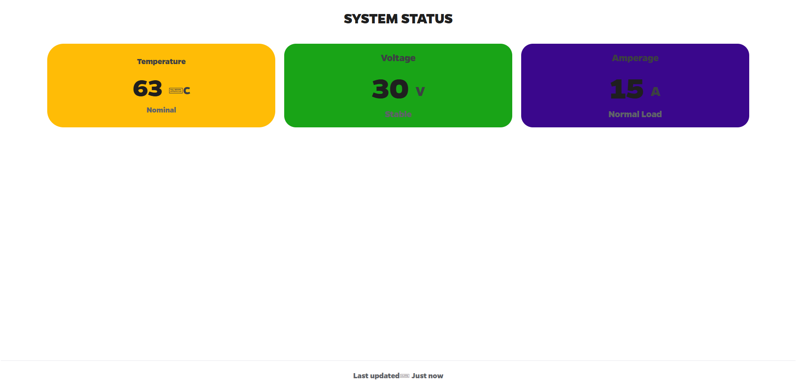

This project is a full-stack real-time IoT system using ESP32, Flask, and Socket.IO for live data visualization.  -->  LOCAL Server/ WEBSITE. Here, I added Only Temp, AMPs, VOLT but you can edit the Hardware/Main.io  file whatever you want.

How to Install it?
__________________

1. Make sure you have Python installed in the system 
2. 'pip install flask'  Run this command
3. Read the requirements.txt   then install those Modules with 'pip'
4. Install Arduino IDE 2.0 Then go to Board Manager  Install this 
5. Upload the code to ur ESP  *Check If Serial monitor giving HTTP 200 if YEs then Good you need to Start the Flask server first
6. Then Run 'make start'

I will be updating this Soon...